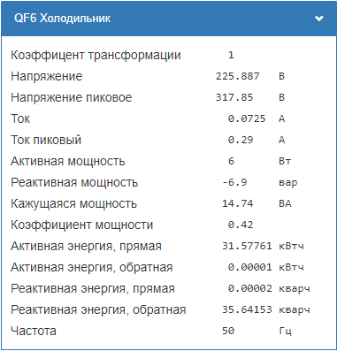
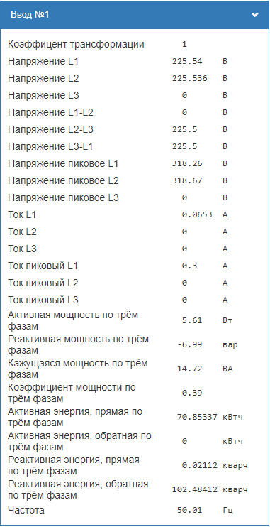

[](https://github.com/SmithLEDs/wb-buttonLight/releases/latest)
[](https://t.me/SmithLEDs)

<h1 align="left">
  <br>
  
  <br>
  <b>Конвертер получаемых данных от счётчика электроэнергии WB-MAP</b>
  <br>
</h1>

## Описание

Данный модуль создает новое виртуальное устройство с новыми контролами для отображения электрических параметров из счетчика электроэнергии WB-MAP. 

* Можно передать параметры однофазной или трёхфазной нагрузки.
* Возможность указать коэффицент трансформации (по умолчанию равен 1), если идет измерение больших токов и используются промежуточные трансформаторы. [Пример расчета коэффицента на портале техподдержки](https://support.wirenboard.com/t/pomoshh-v-podbore-vtorichnogo-transformatora-toka/24468).
* Во все новые контролы с физических устройств передаются meta #error и при сбоях подкрашиваются красным цветом.

## Передаваемые параметры в функцию и их описание:
- `title` - Описание виртуального устройства (Можно на русском)
- `name` - Имя виртуального устройства (Будет отображаться в новом виртуальном кстройстве как `name/...` )
- `targetChannels` - Объект, в свойствах которого передаются все топики электрических параметров нагрузки и коэффицент трансформации

## Примеры

На этом этапе у вас уже должен быть загружен модуль в контроллер. Смотри инструкцию на [главной странице](https://github.com/SmithLEDs/wirenboard#установка-модулей-в-контроллер).

### Однофазная нагрузка.

```js
var electricalChannel = require('moduleConverterMAP');  // Подключаем наш модуль

// Создаем объект для однофазной нагрузки
var target1Phase = {
    coefficient: 1,
    Urms: 'wb-map3e_165/Urms L1',
    Upeak: 'wb-map3e_165/Upeak L1',
    Irms: 'wb-map3e_165/Irms L1',
    Ipeak: 'wb-map3e_165/Ipeak L1',
    P: 'wb-map3e_165/P L1',
    Q: 'wb-map3e_165/Q L1',
    S: 'wb-map3e_165/S L1',
    PF: 'wb-map3e_165/PF L1',
    APenergy: 'wb-map3e_165/AP energy L1',
    ANenergy: 'wb-map3e_165/AN energy L1',
    RPenergy: 'wb-map3e_165/RP energy L1',
    RNenergy: 'wb-map3e_165/RN energy L1',
    Frequency: 'wb-map3e_165/Frequency'
};

// Вызываем функцию создания нового виртуального устройства, где указываем:
// 'QF6 Холодильник' - удобочитаемое имя 
// 'QF6' - имя устройства 
// target1Phase - Объект с свойствами электрических параметров
electricalChannel.createElectricalChannel('QF6 Холодильник' , 'QF6' , target1Phase );
```
<h1 align="center">
  
  <br>
</h1>

### Трёхфазная нагрузка.

```js
var electricalChannel = require('moduleConverterMAP');  // Подключаем наш модуль

// Создаем объект для трёхфазной нагрузки
var target3Phase = {
    coefficient: 1,
    UrmsL1: 'wb-map3e_165/Urms L1',
    UrmsL2: 'wb-map3e_165/Urms L2',
    UrmsL3: 'wb-map3e_165/Urms L3',
    U_L1_L2: 'wb-map3e_165/U L1-L2',
    U_L2_L3: 'wb-map3e_165/U L2-L3',
    U_L3_L1: 'wb-map3e_165/U L3-L1',
    UpeakL1: 'wb-map3e_165/Upeak L1',
    UpeakL2: 'wb-map3e_165/Upeak L2',
    UpeakL3: 'wb-map3e_165/Upeak L3',
    IrmsL1: 'wb-map3e_165/Irms L1',
    IrmsL2: 'wb-map3e_165/Irms L2',
    IrmsL3: 'wb-map3e_165/Irms L3',
    IpeakL1: 'wb-map3e_165/Ipeak L1',
    IpeakL2: 'wb-map3e_165/Ipeak L2',
    IpeakL3: 'wb-map3e_165/Ipeak L3',
    totalP: 'wb-map3e_165/Total P',
    totalQ: 'wb-map3e_165/Total Q',
    totalS: 'wb-map3e_165/Total S',
    totalPF: 'wb-map3e_165/Total PF',
    totalAPenergy: 'wb-map3e_165/Total AP energy',
    totalANenergy: 'wb-map3e_165/Total AN energy',
    totalRPenergy: 'wb-map3e_165/Total RP energy',
    totalRNenergy: 'wb-map3e_165/Total RN energy',
    Frequency: 'wb-map3e_165/Frequency'
};

// Вызываем функцию создания нового виртуального устройства
electricalChannel.createElectricalChannel('Ввод №1' , 'QF1_vvod1' , target3Phase );
```
<h1 align="center">
  
  <br>
</h1>

## Мини WiKi

- [Описание типов Wiren Board MQTT Conventions](https://github.com/wirenboard/conventions/blob/main/README.md)
- [Про трансформаторы тока и коэфицент трансформации для больших токов](https://wirenboard.com/wiki/WB-MAP12E_Multi-channel_Modbus_Power_Meter#:~:text=%D0%B8%20L2%20%D0%BF%D0%B5%D1%80%D0%B5%D0%BF%D1%83%D1%82%D0%B0%D0%BD%D1%8B-,%D0%9F%D0%BE%D0%B4%D0%BA%D0%BB%D1%8E%D1%87%D0%B5%D0%BD%D0%B8%D0%B5%20%D0%B8%D0%B7%D0%BC%D0%B5%D1%80%D0%B8%D1%82%D0%B5%D0%BB%D1%8C%D0%BD%D1%8B%D1%85%20%D1%82%D1%80%D0%B0%D0%BD%D1%81%D1%84%D0%BE%D1%80%D0%BC%D0%B0%D1%82%D0%BE%D1%80%D0%BE%D0%B2%20%D0%B4%D0%BB%D1%8F%20%D0%B1%D0%BE%D0%BB%D1%8C%D1%88%D0%B8%D1%85%20%D1%82%D0%BE%D0%BA%D0%BE%D0%B2,-%D0%A1%D1%82%D0%B0%D0%BD%D0%B4%D0%B0%D1%80%D1%82%D0%BD%D1%8B%D0%B9%20%D1%82%D1%80%D0%B0%D0%BD%D1%81%D1%84%D0%BE%D1%80%D0%BC%D0%B0%D1%82%D0%BE%D1%80%20800)
- [Полный список измеряемых параметров на официальной странице компании Wiren Board](https://wirenboard.com/wiki/Power_Meter_WB-MAP12H_Measuring_Parameters) 
- [Пример расчета коэффицента на портале техподдержки](https://support.wirenboard.com/t/pomoshh-v-podbore-vtorichnogo-transformatora-toka/24468)

### Параметры для однофазной нагрузки

| Обозначение | Описание | Диапазон измеряемых значений | Ед.изм. | Погрешность |
|---|---|---| :---: |---|
| `Urms`      | Среднеквадратическое значение фазного напряжения | 3 — 265      | В      | ±0,5 %              |
| `Upeak`     | Пиковое значение фазного напряжения              |              | В      | ±0,5 %              |
| `Frequency` | Частота                                          | 45 — 65      | Гц     | ±0,01 Гц            |
| `Irms`      | Среднеквадратическое значение фазного тока       |              | А      | ±0,5 %              |
| `Ipeak`     | Пиковое значение фазного тока                    |              | А      | ±0,5 %              |
| `P`         | Активная однофазная мощность                     | 0.01 — 27000 | Вт     | класс точности 0,5S |
| `Q`         | Реактивная однофазная мощность                   | 0.01 — 27000 | вар    | класс точности 1    |
| `S`         | Кажущаяся однофазная мощность                    | 0.01 — 27000 | В·А    | ±0,5 %              |
| `PF`        | Коэффициент мощности                             | от -1 до 1   |        | ±0,5 %              |
| `AP energy` | Активная фазная энергия, прямая                  |              | кВт·ч  | класс точности 0.5S |
| `AN energy` | Активная фазная энергия, обратная                |              | кВт·ч  | класс точности 0.5S |
| `RP energy` | Реактивная фазная энергия, прямая                |              | квар·ч | класс точности 1    |
| `RN energy` | Реактивная фазная энергия, обратная              |              | квар·ч | класс точности 1    |

### Параметры для трехфазной нагрузки

| Обозначение | Описание | Диапазон измеряемых значений | Ед.изм. | Погрешность |
|---|---|---| :---: |---|
| `Urms L1`         | Среднеквадратическое значение фазного напряжения L1 | 3 — 265      | В      | ±0,5 %              |
| `Urms L2`         | Среднеквадратическое значение фазного напряжения L2 | 3 — 265      | В      | ±0,5 %              |
| `Urms L3`         | Среднеквадратическое значение фазного напряжения L3 | 3 — 265      | В      | ±0,5 %              |
| `U L1-L2`         | Линейное напряжение между фазами L1 и L2            | 3 - 460      | В      | ±0,5 %              |
| `U L2-L3`         | Линейное напряжение между фазами L2 и L3            | 3 - 460      | В      | ±0,5 %              |
| `U L3-L1`         | Линейное напряжение между фазами L3 и L1            | 3 - 460      | В      | ±0,5 %              |
| `Upeak L1`        | Пиковое значение фазного напряжения L1              |              | В      | ±0,5 %              |
| `Upeak L2`        | Пиковое значение фазного напряжения L2              |              | В      | ±0,5 %              |
| `Upeak L3`        | Пиковое значение фазного напряжения L3              |              | В      | ±0,5 %              |
| `Frequency`       | Частота                                             | 45 — 65      | Гц     | ±0,01 Гц            |
| `Irms L1`         | Среднеквадратическое значение фазного тока L1       |              | А      | ±0,5 %              |
| `Irms L2`         | Среднеквадратическое значение фазного тока L2       |              | А      | ±0,5 %              |
| `Irms L3`         | Среднеквадратическое значение фазного тока L3       |              | А      | ±0,5 %              |
| `Ipeak L1`        | Пиковое значение фазного тока L1                    |              | А      | ±0,5 %              |
| `Ipeak L2`        | Пиковое значение фазного тока L2                    |              | А      | ±0,5 %              |
| `Ipeak L3`        | Пиковое значение фазного тока L3                    |              | А      | ±0,5 %              |
| `Total P`         | Активная однофазная мощность по трём фазам          | 0.01 — 27000 | Вт     | класс точности 0,5S |
| `Total Q`         | Реактивная однофазная мощность по трём фазам        | 0.01 — 27000 | вар    | класс точности 1    |
| `Total S`         | Кажущаяся однофазная мощность по трём фазам         | 0.01 — 27000 | В·А    | ±0,5 %              |
| `Total PF`        | Коэффициент мощности по трём фазам                  | от -1 до 1   |        | ±0,5 %              |
| `Total AP energy` | Активная фазная энергия, прямая по трём фазам       |              | кВт·ч  | класс точности 0.5S |
| `Total AN energy` | Активная фазная энергия, обратная по трём фазам     |              | кВт·ч  | класс точности 0.5S |
| `Total RP energy` | Реактивная фазная энергия, прямая по трём фазам     |              | квар·ч | класс точности 1    |
| `Total RN energy` | Реактивная фазная энергия, обратная по трём фазам   |              | квар·ч | класс точности 1    |

## Версии движка правил, на которых проверялась работоспособность:

- `v2.23.1-1-ge77bad7`
- `v2.25.0-2-g105d68c`
